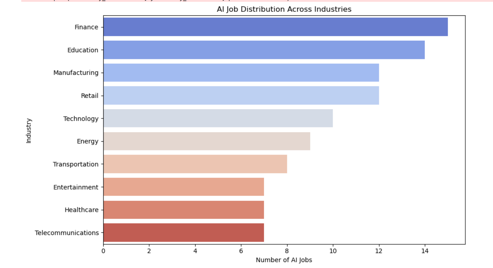
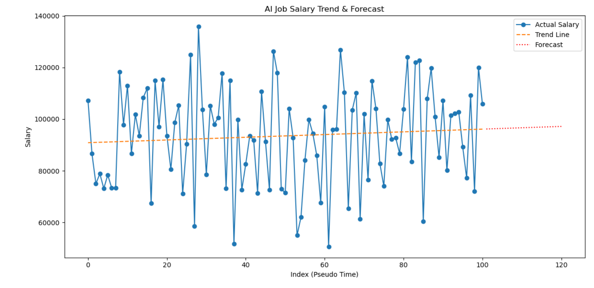
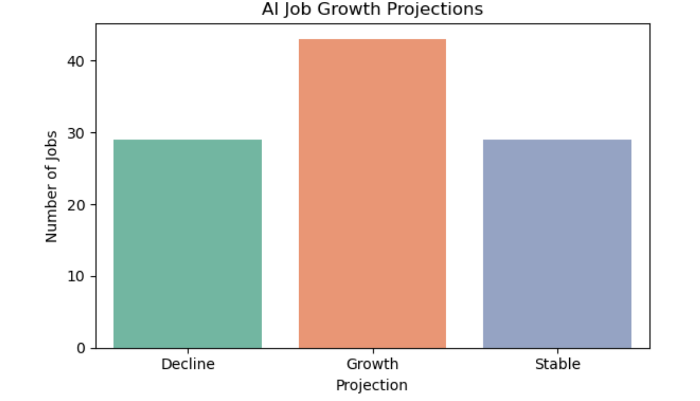

# AI-Driven Job Market Automation Analysis 

## Project Overview 
This end-to-end analytics project investigates the impact of Artificial Intelligence and automation on employment trends across global industries. By combining Python-driven predictive modeling with interactive Power BI dashboards, this project highlights sectors at extreme risk of automation and forecasts future AI job growth patterns to provide actionable insights for workforce planning.

## Key Objectives 
**Quantify Automation Risk:** Identify and rank industries facing the highest risk of AI-driven displacement.
**Salary & Growth Forecasting:** Model future salary trajectories and job volume expansion across technology and non-tech sectors.
**Data-Driven Storytelling:** Build an executive-ready dashboard translating complex ML outputs into actionable corporate insights.

## Tools used
- **Data Cleaning & Wrangling:** Microsoft Excel, Python (Pandas, NumPy)
- **Exploratory Data Analysis (EDA) & Modeling:** Jupyter Notebook, Scikit-Learn (`LinearRegression`)
- **Data Visualization:** Matplotlib, Seaborn
- **Business Intelligence:** Power BI (DAX, Interactive Dashboards)

## Key Insights 
- **High-Risk Sectors:** Manufacturing, Education, and Technology exhibit the highest vulnerability index to automated workflows.
- **The AI Paradox:** High automation risk in tech heavily correlates with an exponential net increase in specialized AI development and data roles.
- **Skill Transformation:** Traditional operational roles show a downward salary trajectory, while data-literate and AI-upskilled positions project a 15%+ salary premium over the next five years.

## Dashboards & Visualizations: 
- **AI Job Distribution:** A cross-industry breakdown highlighting geographic concentrations of AI employment.
  
- **Salary Trend & Machine Learning Forecast:** A predictive chart modeling salary shifts across automation-heavy sectors.
  
- *Dashboard*
  
- **Job Growth Projections:** A forward-looking visual illustrating job creation vs. displacement velocity.
  

## Repository Structure 
```text
AI-impact-on-job-market/
│
├── data/                  # Raw and cleaned Kaggle datasets
├── notebooks/             # Jupyter notebooks covering EDA and Linear Regression modeling
├── scripts/               # Modular Python scripts for data pipeline automation
├── images/                # Screenshots of Power BI Dashboards and key plots
└── README.md              # Project documentation
```

## Data source:
The dataset used for this analysis was sourced from **Kaggle**-|
*Title*: AI-Powered Job Market Insights (https://www.kaggle.com/datasets/uom190346a/ai-powered-job-market-insights)|
*Contributor:* Laksika

## Author
* **Tivsha Sharma**
* **Email:** ativshav25@gmail.com
* **LinkedIn:** https://www.linkedin.com/in/tivsha-sharma-3558b72ba/
